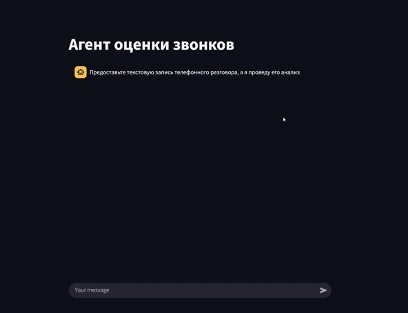

# Call Analyze Agent

Агент для анализа тональности телефонных разговоров и генерации рекомендаций с использованием GigaChat API.

## Архитектура

```
Пользователь → Streamlit Интерфейс → GigaChat Клиент → GigaChat API → Ответ
```

## Модель

**GigaChat 2.0**

Ссылка на модель: https://giga.chat/

## Запуск

Клонирование репозитория:
```bash
git clone https://github.com/thegrosss/Call-Analyze-Agent
```

Запуск:

```bash
pip install -r requirements.txt
streamlit run app/main.py
```
или

```bash
docker build -t call_agent_image .
docker run --name call_agent -p 8501:8501 call_agent_image
```

## Как использовать

1. Запустите приложение по адресу http://localhost:8501
2. Введите текст телефонного разговора
3. Получите анализ тона и рекомендации



